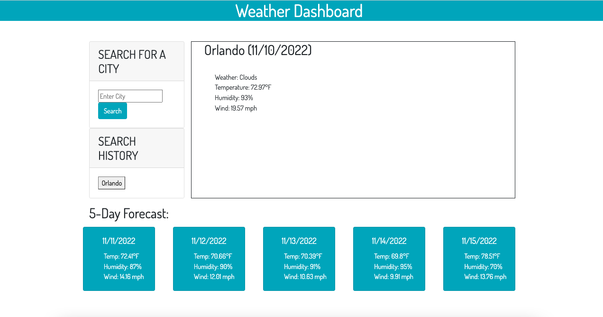

# Weather Dashboard API Project

## User Story 
```md
AS A traveler
I WANT to see the weather outlook for multiple cities
SO THAT I can plan a trip accordingly
```

## Description

This project tested my knowledge of third-party and server-side APIs, JavaScript, jQuery.  I ensured that the code was debugged to the best of my ability and ran correctly.  This assignment was challenging but the implementation of server-side APIs has helped to further understand JS concepts. When I got stuck I used Google to research local storage and read through StackOverflow, and watched YouTube videos, as well as researching specific elements in W3Schools and MDN. 

---

## Links

- Click the link below to access the deployed site on GitHub Pages.<br>
https://magmesser.github.io/weather-dashboard/


- Click the link below to access to application repository on GitHub. <br>
https://github.com/magmesser/weather-dashboard


---

## Screenshot

The following screenshot shows the web application's appearance: 




